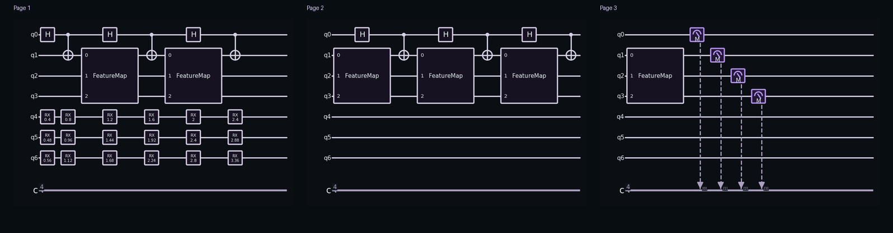
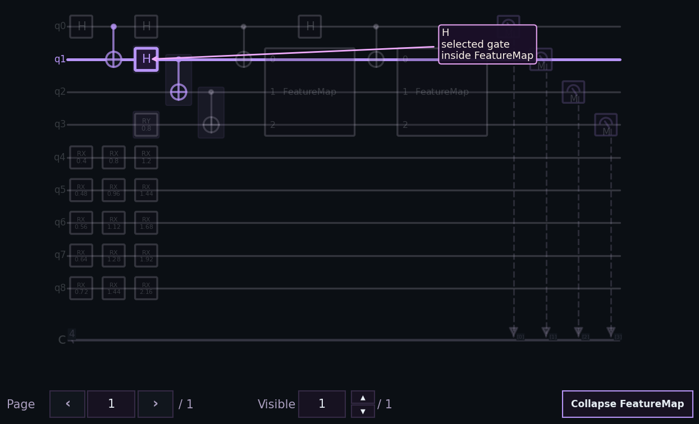
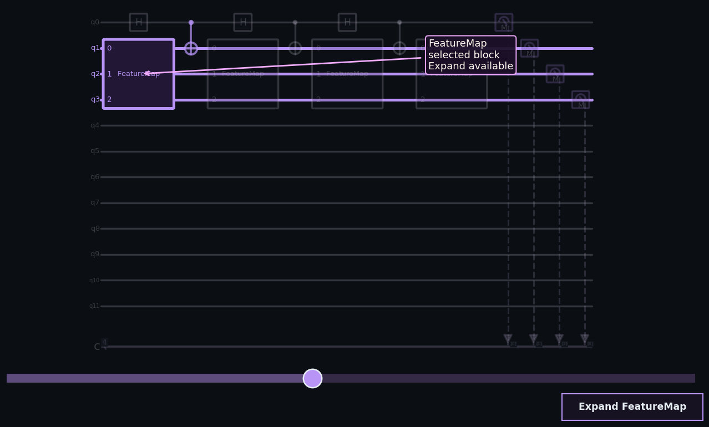
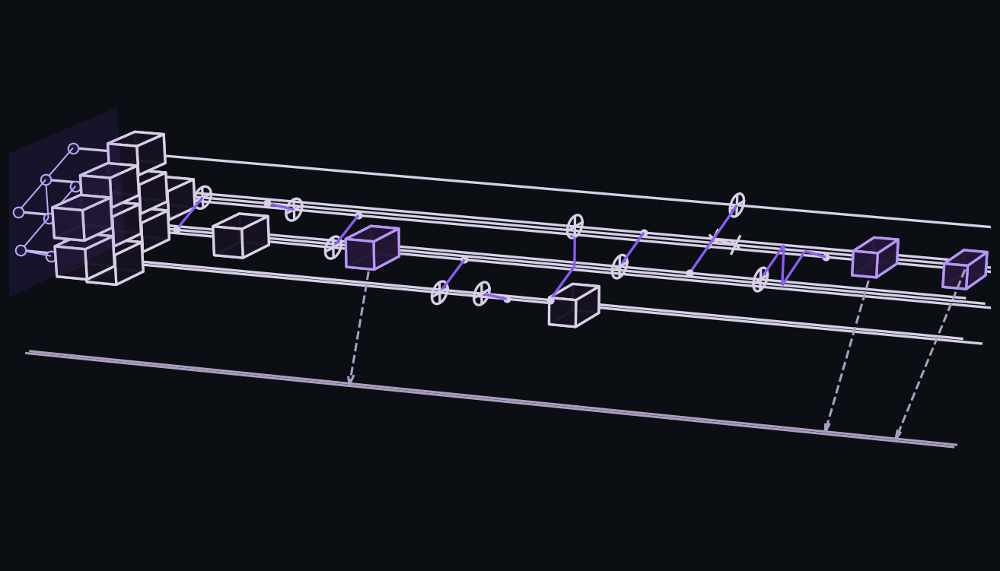
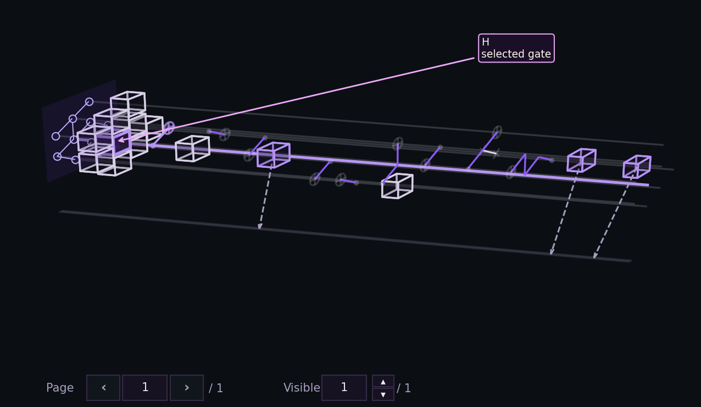
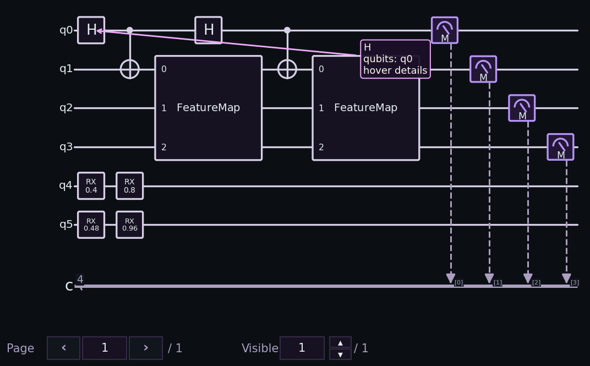

# User guide

This guide focuses on how the library behaves in real use, not just on listing parameters.
For the full user-facing manual with more examples, mode details, CLI flag tables, framework notes, and troubleshooting paths, see the [Extended guide](extended_guide.md).

The best way to think about `quantum-circuit-drawer` is:

- your framework or IR object stays the source of truth
- the config objects let you steer rendering without changing your workflow
- the result objects give you a stable handle back

The most common user-facing tasks are:

- draw a circuit from the object you already built
- save that figure without opening a GUI window
- export the same circuit with `circuit_to_latex(...)`
- compare two circuit versions
- plot or compare result distributions

## Circuit Workflows

### The normal script workflow

```python
from quantum_circuit_drawer import DrawConfig, OutputOptions, draw_quantum_circuit

result = draw_quantum_circuit(
    circuit,
    config=DrawConfig(output=OutputOptions(show=False)),
)
```

This is the default recommendation for scripts because it gives you:

- one stable `DrawResult`
- library-managed figures
- room to switch modes later without rewriting the call shape

### Auto mode

`DrawMode.AUTO` resolves by runtime context:

- real notebook: `pages`
- normal `.py` execution: `pages_controls`

That means you can often leave `mode` alone until you have a reason to override it.

### When to choose each draw mode

#### `pages`

Use this when you want explicit pages:

- notebooks
- export workflows
- direct access to every page through `DrawResult.figures`

In managed 2D mode, the library creates one figure per page. In managed 3D mode, it creates one figure per 3D page window.



#### `pages_controls`

Use this when you want a managed page browser:

- 2D: `Page` and `Visible`, plus `Wires: All/Active`, `Ancillas: Show/Hide`, and a contextual `Collapse` / `Expand` block action when semantic provenance is available
- 3D: `Page` and `Visible`, plus the same contextual `Wires`, `Ancillas`, and block controls when they can change the current view, with several visible 3D pages stacked vertically

This is the best default for normal script execution.



If you want a concrete showcase for those 2D controls, start with `qiskit-2d-exploration-showcase` from [Examples](../examples/README.md).

If you want the managed 3D version of that workflow, start with `qiskit-3d-exploration-showcase`.

#### `slider`

Use this when the circuit is wide and you want a viewport instead of separate pages:

- 2D: horizontal and vertical sliders when needed, click-based contextual selection, `Wires: All/Active`, `Ancillas: Show/Hide`, contextual block collapse/expand, and folded-wire markers such as `... N hidden wires ...` when intermediate wires are filtered out
- 3D: horizontal slider, click-based topology-aware selection, and the same contextual `Wires`, `Ancillas`, and block collapse/expand controls when semantic provenance is available

Selection and wire filtering work for plain `CircuitIR` too. Block collapse/expand depends on semantic provenance from the current adapter path, so it may stay disabled for narrower legacy inputs that do not expose enough block structure.

`qiskit-2d-exploration-showcase` is the clearest bundled demo for this path because it combines idle wires, ancillas, and reusable composite blocks in one workflow.



`qiskit-3d-exploration-showcase` is the clearest bundled demo for the 3D path because it combines topology-aware selection, expand/collapse, and persistent expanded-block highlighting in one managed scene.

#### `full`

Use this when the whole circuit fits comfortably in one scene and you want the unpaged view directly.

### OpenQASM 2 and 3 inputs

`draw_quantum_circuit(...)` accepts OpenQASM 2 text, OpenQASM 3 text, `.qasm` files, and `.qasm3` files. OpenQASM 2 uses the `quantum-circuit-drawer[qiskit]` extra; OpenQASM 3 uses `quantum-circuit-drawer[qasm3]`, which adds `qiskit-qasm3-import`.

```python
from pathlib import Path

from quantum_circuit_drawer import (
    CircuitRenderOptions,
    DrawConfig,
    DrawSideConfig,
    OutputOptions,
    draw_quantum_circuit,
)

result = draw_quantum_circuit(
    Path("bell.qasm"),
    config=DrawConfig(
        side=DrawSideConfig(render=CircuitRenderOptions(framework="qasm")),
        output=OutputOptions(show=False),
    ),
)
```

For text input, the string must start with `OPENQASM`. For file input, the path must end in `.qasm` or `.qasm3`, exist on disk, be readable as UTF-8, and contain OpenQASM 2 or OpenQASM 3 text starting with `OPENQASM`. Use `CircuitRenderOptions(framework="qasm")` when you want the parser path to be explicit for either version.

## Caller-Managed Axes

Pass `ax=...` only for static rendering.

```python
import matplotlib.pyplot as plt

from quantum_circuit_drawer import (
    CircuitRenderOptions,
    DrawConfig,
    DrawMode,
    DrawSideConfig,
    OutputOptions,
    draw_quantum_circuit,
)

figure, axes = plt.subplots(figsize=(8, 3))
result = draw_quantum_circuit(
    circuit,
    ax=axes,
    config=DrawConfig(
        side=DrawSideConfig(render=CircuitRenderOptions(mode=DrawMode.PAGES)),
        output=OutputOptions(show=False),
    ),
)
```

Use this when the circuit is just one subplot in a larger figure. Do not combine `ax=...` with `pages_controls` or `slider`.

## Saving

`output_path` always saves a clean figure:

- `pages`, `pages_controls`, and `slider` save the concatenated paged composition
- `full` saves the full unpaged scene

```python
from quantum_circuit_drawer import (
    CircuitRenderOptions,
    DrawConfig,
    DrawSideConfig,
    OutputOptions,
    draw_quantum_circuit,
)

draw_quantum_circuit(
    circuit,
    config=DrawConfig(
        side=DrawSideConfig(render=CircuitRenderOptions(mode="slider")),
        output=OutputOptions(output_path="circuit.png", show=False),
    ),
)
```

This lets you use an interactive mode during work and still export a clean image without widget chrome.

## LaTeX Export

Use `circuit_to_latex(...)` when you want source text instead of a Matplotlib figure:

```python
from quantum_circuit_drawer import DrawMode, LatexBackend, circuit_to_latex

latex_result = circuit_to_latex(
    circuit,
    backend=LatexBackend.QUANTIKZ,
    mode=DrawMode.PAGES,
)
```

Use this path when:

- you are preparing a paper or report
- you want `quantikz` snippets to edit by hand afterwards
- you want paged 2D output that matches the normal draw flow without creating windows

`LatexBackend.QUANTIKZ` is the main export backend. `LatexBackend.TIKZ` is available for simpler experimental `tikzpicture` output.

## 3D Workflows

3D rendering is useful when topology matters visually or when you want a hardware-layout perspective.

```python
from quantum_circuit_drawer import (
    CircuitRenderOptions,
    DrawConfig,
    DrawSideConfig,
    OutputOptions,
    draw_quantum_circuit,
)

result = draw_quantum_circuit(
    circuit,
    config=DrawConfig(
        side=DrawSideConfig(
            render=CircuitRenderOptions(
                view="3d",
                mode="pages_controls",
                topology="grid",
                topology_qubits="used",
                topology_resize="error",
                topology_menu=True,
                direct=False,
            ),
        ),
        output=OutputOptions(show=False),
    ),
)
```

What changes in 3D:

- `pages` works
- `pages_controls` works
- `slider` is horizontal only
- `full` works
- managed `pages_controls` preserves a shared camera while you navigate
- managed 3D exploration keeps a selected operation active while you rotate, and only clears it on a clean background click

| 3D topology layout | 3D selected gate hover |
| --- | --- |
|  |  |

The built-in topology names are flexible: `"line"`, `"grid"`, `"star"`, `"star_tree"`, and `"honeycomb"` can all be built for arbitrary positive qubit counts. The `"honeycomb"` builder uses an IBM-inspired compact hexagonal footprint. For a circuit that uses fewer qubits than the topology contains, `topology_qubits="used"` renders only the first allocated topology nodes, while `topology_qubits="all"` keeps the inactive physical nodes visible and labels them with their topology ids. For non-static topologies, `topology_resize="fit"` lets the renderer rebuild the topology when the circuit needs more nodes; static `HardwareTopology` inputs stay exact and raise an explicit size error instead.

## Presets, Style, And Hover

### Presets

Presets are the quickest way to change the overall feel of the output:

- `paper`
- `notebook`
- `compact`
- `presentation`
- `accessible`

They are useful when you want a sensible baseline without tuning many style fields manually. Use `accessible` for high-contrast output that relies less on color alone.

```python
from quantum_circuit_drawer import (
    CircuitAppearanceOptions,
    DrawConfig,
    DrawSideConfig,
    OutputOptions,
    StylePreset,
    draw_quantum_circuit,
)

result = draw_quantum_circuit(
    circuit,
    config=DrawConfig(
        side=DrawSideConfig(
            appearance=CircuitAppearanceOptions(preset=StylePreset.PRESENTATION),
        ),
        output=OutputOptions(show=False),
    ),
)
```

### Fine style control

You can still override individual fields:

```python
from quantum_circuit_drawer import CircuitAppearanceOptions, DrawConfig, DrawSideConfig

config = DrawConfig(
    side=DrawSideConfig(
        appearance=CircuitAppearanceOptions(
            preset="paper",
            style={
                "max_page_width": 9.0,
                "wire_line_width": 1.8,
                "classical_wire_line_width": 1.5,
                "connection_line_width": 1.9,
                "measurement_line_width": 1.4,
            },
            hover={"enabled": True, "show_size": True},
        ),
    ),
)
```

`DrawTheme` covers more than circuit strokes now. It also covers:

- control markers
- control connections
- topology colors
- managed UI colors
- hover colors

### Hover

Hover is optional and public through `DrawConfig.side.appearance.hover`.

Typical example:

```python
from quantum_circuit_drawer import (
    CircuitAppearanceOptions,
    DrawConfig,
    DrawSideConfig,
    OutputOptions,
)

config = DrawConfig(
    side=DrawSideConfig(
        appearance=CircuitAppearanceOptions(
            hover={
                "enabled": True,
                "show_size": True,
                "show_matrix": "auto",
                "matrix_max_qubits": 2,
            },
        ),
    ),
    output=OutputOptions(show=False),
)
```



Use `show_matrix="never"` when you want the lightest path, especially for frameworks that may be heavier on native Windows.

## Recoverable Unsupported Operations

The default policy is strict:

```python
from quantum_circuit_drawer import (
    CircuitRenderOptions,
    DrawConfig,
    DrawSideConfig,
    OutputOptions,
    UnsupportedPolicy,
)

config = DrawConfig(
    side=DrawSideConfig(
        render=CircuitRenderOptions(unsupported_policy=UnsupportedPolicy.RAISE),
    ),
    output=OutputOptions(show=False),
)
```

If you prefer a best-effort drawing with placeholders for recoverable unsupported operations:

```python
config = DrawConfig(
    side=DrawSideConfig(
        render=CircuitRenderOptions(unsupported_policy=UnsupportedPolicy.PLACEHOLDER),
    ),
    output=OutputOptions(show=False),
)
```

This can be useful when you are inspecting larger circuits and want to keep visual continuity even if some operations are not yet fully representable.

## Comparison Workflows

### Compare two or more circuits

`compare_circuits(...)` is the quickest way to inspect structural change.

```python
from quantum_circuit_drawer import (
    CircuitCompareConfig,
    CircuitCompareOptions,
    OutputOptions,
    compare_circuits,
)

result = compare_circuits(
    left_circuit,
    right_circuit,
    config=CircuitCompareConfig(
        compare=CircuitCompareOptions(
            left_title="Before",
            right_title="After",
        ),
        output=OutputOptions(show=False),
    ),
)
```

What you get back:

- one normal per-circuit figure plus one compact summary figure by default
- one figure with one axes per circuit when you request `mode="full"` or pass caller-owned axes
- one nested `DrawResult` per circuit, so each circuit exposes its own figures, axes, mode, and page count
- metrics such as layers, total operations, multi-qubit operations, swaps, and measurements
- an optional compact summary card; the summary focuses on stable aggregate metrics and does not report diff-column counts

Pass extra circuits as additional positional arguments when you want to compare 3+ variants. In that case, set `CircuitCompareOptions(titles=(...))` with one title per circuit. The summary table uses one column per circuit instead of a delta column; lower aggregate values are shown in green and higher aggregate values in red for each row.

Use this for:

- transpilation inspection
- compact vs expanded composite comparison
- version-to-version circuit regressions

### Compare two or more histograms

Use `compare_histograms(...)` when you want aligned distributions on the same state space.

```python
from quantum_circuit_drawer import (
    HistogramCompareConfig,
    HistogramCompareOptions,
    OutputOptions,
    compare_histograms,
)

result = compare_histograms(
    left_data,
    right_data,
    config=HistogramCompareConfig(
        compare=HistogramCompareOptions(
            left_label="Ideal",
            right_label="Sampled",
            sort="delta_desc",
        ),
        output=OutputOptions(show=False),
    ),
)
```

This is especially useful for:

- ideal vs sampled comparisons
- baseline vs new execution comparisons
- comparing two result objects with the same logical meaning but different noise levels

On interactive Matplotlib backends, the compare legend is clickable so you can focus one selected series at a time without rebuilding the figure.

For 3+ distributions, pass more data objects after the first two and provide `HistogramCompareOptions(series_labels=(...))`. The returned `series_values` field contains every aligned series; the older `left_values`, `right_values`, and `delta_values` fields remain as the first-two compatibility view.

## Histogram Workflows

### Single histogram

```python
from quantum_circuit_drawer import HistogramConfig, OutputOptions, plot_histogram

result = plot_histogram(
    data,
    config=HistogramConfig(output=OutputOptions(show=False)),
)
```

### Counts vs quasi-probabilities

`HistogramKind.AUTO` infers counts when the values are non-negative integers and otherwise treats the data as quasi-probabilities.

When quasi-probabilities stay non-negative, the histogram keeps a zero-based vertical axis like the counts view. If any visible value is negative, the axis expands below zero again.

You can still force the meaning:

```python
from quantum_circuit_drawer import HistogramConfig, HistogramDataOptions, HistogramKind, OutputOptions

config = HistogramConfig(
    data=HistogramDataOptions(kind=HistogramKind.QUASI),
    output=OutputOptions(show=False),
)
```

### Sorting, top-k, and labels

Useful controls:

- `sort="state"`
- `sort="state_desc"`
- `sort="value_desc"`
- `sort="value_asc"`
- `top_k=<n>`
- `state_label_mode="binary" | "decimal"`

### Marginals

Use `HistogramDataOptions(qubits=(...))` when you want a joint marginal over selected qubits:

```python
from quantum_circuit_drawer import HistogramConfig, HistogramDataOptions, OutputOptions, plot_histogram

result = plot_histogram(
    {"101": 2, "001": 1, "111": 3},
    config=HistogramConfig(
        data=HistogramDataOptions(qubits=(0, 2)),
        output=OutputOptions(show=False),
    ),
)
```

The qubit order is preserved exactly as passed.

### Interactive histogram mode

`HistogramMode.AUTO` resolves by runtime context:

- normal script: `interactive`
- notebook widget backend such as `nbagg`, `ipympl`, or `widget`: `interactive`
- inline or non-widget notebook backend: `static`

In interactive mode, the managed figure can add:

- a slider viewport
- per-bin hover
- an order button that shows the current mode
- a label button for binary or decimal labels
- a `Mode: Counts` / `Mode: Quasi` toggle when the original input is counts
- a slider button when hidden bins exist
- a marginal-qubits text box

Interactive histograms also support keyboard shortcuts:

- `Left` / `Right`: move the visible slider window one step
- `s`: cycle the ordering mode
- `b`: toggle binary or decimal state labels
- `q`: switch between counts and quasi view when both exist
- `m`: focus the marginal-qubits text box
- `0`: restore the original interactive histogram view
- `?`: toggle the shortcut-help overlay

Set `HistogramAppearanceOptions(hover=False)` if you want the interactive controls without hover labels.

## Framework-Native Result Inputs

`plot_histogram(...)` is not limited to raw `dict` data.

It also accepts:

- plain mappings such as `dict` or `Counter`
- Qiskit counts, quasi-distributions, and sampler result containers
- Cirq `Result` / `ResultDict` measurement mappings
- PennyLane `qml.counts()` dictionaries, `qml.probs()` vectors, and `qml.sample()` arrays
- MyQLM `qat.core.Result` objects through `raw_data`
- CUDA-Q `SampleResult`-style objects through `items()`

If a framework returns several payloads at once, pass the tuple or list directly and choose one entry with `HistogramConfig(data=HistogramDataOptions(result_index=...))`.

## Working With The Result Objects

### `DrawResult`

The most used fields are:

- `primary_figure`
- `primary_axes`
- `figures`
- `axes`
- `page_count`
- `detected_framework`
- `interactive_enabled`
- `hover_enabled`
- `saved_path`
- `warnings`

### `HistogramResult`

The most used fields are:

- `figure`
- `axes`
- `kind`
- `state_labels`
- `values`
- `qubits`
- `diagnostics`
- `saved_path`

### Comparison results

For comparisons, keep an eye on:

- `CircuitCompareResult.metrics`
- `HistogramCompareResult.metrics`
- `HistogramCompareResult.saved_path`

Those metrics are often enough to summarize structural or distribution change programmatically.

## Framework-Free Workflows

If you want a framework-free path, choose one of these:

- `CircuitBuilder` for small or generated circuits
- public `CircuitIR` types for full control

That path is especially useful for:

- custom preprocessors
- research tooling
- tests
- pipelines where the circuit source is not one of the built-in adapters
